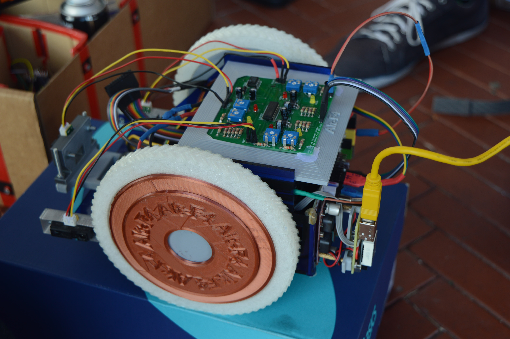
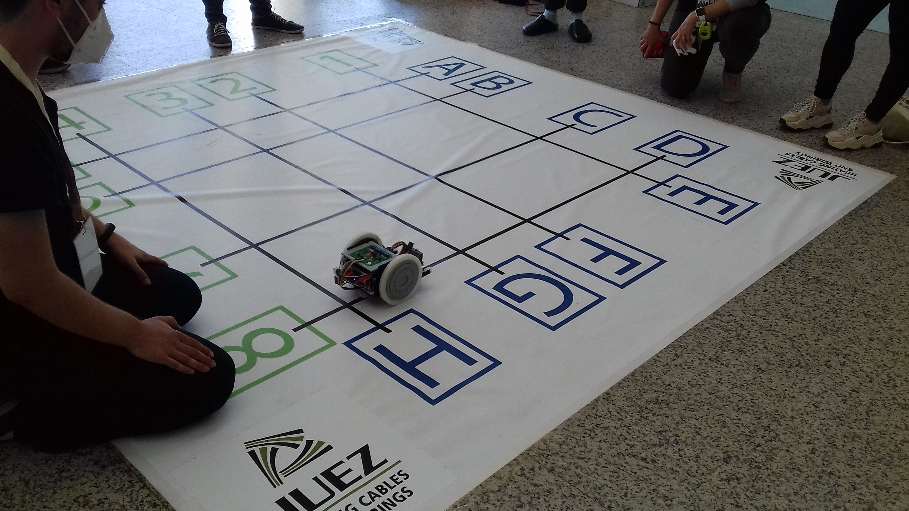

# Robot-Cuadricula-ALT-F4
Robot-Cuadricula-ALT-F4

Repositorio del programa demostrativo de la cuadrícula del robot del equipo de ALT+F4. 

El conjunto de programas del robot cuando se presentó al concurso Astichallenge es propiedad intelectual del equipo y no se encuentra público. Este programa es cortesía del equipo de ALT+F4.

Robot realizado por:  
Release 20/21: Leonel, Manu, Andrés  
Release 19/20: Leonel, Andrés, Raúl, Luis, Héctor, Henrry, Dani, Jesús  

### Imagenes

 
 
 

 
 
 

### Instrucciones de uso:

- Verificar que la batería está cargada

- Verificar la conexión de los cables, en un principio no se ha de desconectar ninguno, en caso de que haya alguno desconectado, los cables tienen marcado el pin al que han de ir conectado, puede ayudarse de la imagen en: Media/Conexiones.jpg

- Verificar la calibración de los sensores, la PCB superior dispone de potenciómetros, cuando el sensor esta sobre negro, el led rojo se ha de encender, cuando esta sobre blanco ha de estar apagado.

- Colocar en la posición de salida al robot, encendero y esperar a la autocalibración del giroscopio

### Notas informativas:

Más información del concurso en:  
https://astichallenge.com/

Noticia:  
https://www.etsidi.upm.es/Escuela/Noticias/NoticiasETSIDI?id=d6b3eb2567f0a710VgnVCM10000009c7648a____&fmt=detail&prefmt=articulo

